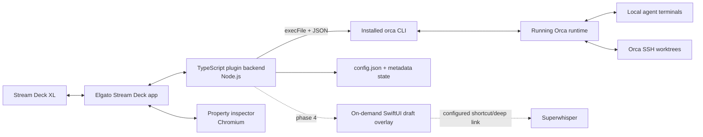

# Orca Agent Deck — Product and Implementation Plan

**Status:** Confirmed product plan; implementation has not started  
**Date:** 2026-07-26  
**Target:** One Stream Deck XL, one MacBook Pro, Orca 1.4.156+, OMP + Claude Code + Codex  
**Working title:** Orca Agent Deck

## 1. Decision

Build a **macOS-only Stream Deck plugin centered on Orca**, not a general terminal automation product and not a line-for-line VibeDeck clone.

The product's first job is a reliable physical attention surface:

1. Show up to 16 Orca agent terminals with stable physical positions.
2. Preserve actionable states until they are acknowledged.
3. Select a terminal without focusing Orca.
4. Send only state-safe background commands to that exact terminal.
5. Focus the exact terminal only when the separate **Focus** key is pressed.

The first installable milestone ends at **dashboard + safe controls**. Draft capture, Superwhisper, new-worktree launch, and usage meters follow on the same architecture.

## 2. What to copy from VibeDeck

VibeDeck's valuable pattern is the interaction model, not its full compatibility matrix:

- Persistent session cards for working, waiting, done, error, and stuck states.
- An explicitly selected session that owns subsequent controls.
- Attention sounds that do not vanish with a transient OS notification.
- State-aware approvals and commands instead of generic foreground keystrokes.
- Local processing and conservative configuration changes.
- Clear separation between **agent state integration** and **terminal control integration**.

Sources: [VibeDeck homepage](https://getvibedeck.com/), [agent compatibility](https://getvibedeck.com/compatibility), [terminal compatibility](https://getvibedeck.com/terminals), and [custom signals](https://getvibedeck.com/signals).

## 3. What not to copy

The personal build deliberately excludes VibeDeck features that do not serve this setup:

- Generic support for six agents and many terminal applications.
- Windows, Stream Deck Mobile, Stream Deck + dials, and multi-computer licensing.
- Closed-session resume outside Orca.
- Keep Awake and Minimize Window controls.
- Persistent global build/test/deploy signal keys.
- Direct model/account mutation.
- Subscription, licensing, telemetry, marketplace distribution, and an updater.
- Standalone OMP, Claude Code, or Codex sessions in v1.

This narrower scope is an advantage: Orca already provides stable terminal identity, focus, input, worktree metadata, remote-host routing, and normalized agent state.

## 4. Confirmed product contract

### Environment

- Personal tool for one MacBook Pro and one Stream Deck XL.
- Stream Deck XL only: 32 LCD keys in an 8 × 4 grid; no dials or touch strip ([Elgato XL](https://www.elgato.com/us/en/p/stream-deck-xl)).
- Agents run through Orca: OMP primarily, plus Claude Code and Codex.
- Include local and Orca-managed SSH worktrees.
- Use the installed, version-matched `orca` CLI as the source of truth.

### Session dashboard

- Top 16 keys represent **individual agent terminals**, not aggregate worktrees.
- A card remains in a stable physical slot until its terminal closes and the state is acknowledged.
- Card identity emphasizes `repo / worktree`, with a smaller agent badge.
- Standard high-contrast state palette:
  - blue — working
  - amber — waiting for input
  - green — done
  - red — error
  - purple — stuck
  - dim gray — idle/inactive
  - charcoal + broken-link icon — identity lost
  - dim gray + closed-terminal icon — closed
  - white border — selected
- State is never encoded by color alone; every state also has an icon/label.
- Stuck threshold: **60 minutes**, configurable.
- State convergence target: **2–3 seconds**.
- OMP subagents aggregate into a contextual count on the parent OMP terminal; they do not consume session slots.

### Selection and control

- Pressing a session card selects it but does not focus Orca or acknowledge it.
- The separate **Focus** key runs `orca terminal switch --terminal <handle>`.
- Background commands use the exact runtime-issued terminal handle.
- Four default presets:
  1. Finish the task.
  2. Run relevant checks and fix failures.
  3. Self-review and simplify/fix the diff.
  4. Review, commit, push, and open a PR under repository rules.
- Ship is agent-driven; the plugin never runs Git mutation commands itself.
- Normal press on Interrupt uses `orca terminal send --interrupt`.
- Holding Interrupt shows a progress state, then runs `orca terminal close` for the selected terminal.
- Structured choices are shown on up to six contextual keys only when their mapping is fresh and exact.
- Unknown, stale, or ambiguous prompts disable background reply and light **Focus** instead.

### Alerts and acknowledgement

- Sound only for waiting-for-input, error, and 60-minute stuck transitions.
- Done is persistent and visual, not audible.
- Orca worktree `unread` supplies the coarse worktree signal; locally observed per-terminal transitions supply card-level unread identity.
- Local metadata tracks each terminal's unread event version when several agents share one worktree.
- Focus and explicit Acknowledge clear that terminal's local event version. A still-true worktree unread level does not re-flag an acknowledged terminal unless a newer agent transition is observed.

### Draft and launch, after the first milestone

- Clipboard, typed overlay, and Superwhisper all feed one draft model.
- Draft must be reviewed before send or worktree creation.
- Superwhisper pastes into the draft overlay, never directly into Orca.
- Draft-first launch creates a new Orca worktree with New OMP, New Claude, or New Codex.
- New worktrees inherit the selected session's project and host by default, including Orca SSH hosts.

### Usage and model display, after the first milestone

- Three agent-family usage keys: OMP, Claude, Codex.
- Current model/reasoning effort is display-only.
- No private Orca database reads and no unsupported provider endpoint scraping.

### Privacy and configuration

- Local-only; no telemetry.
- Persist metadata only: config, slot assignment, selected logical session, acknowledgement timestamps, state timestamps, and sound cooldowns.
- Never persist terminal output, prompts, draft text, dictation audio, or Superwhisper output.
- JSON config is the source of truth; the Stream Deck property inspector edits it.
- Use Orca's managed hooks rather than installing a second competing hook system.

## 5. Stream Deck XL layout

Rows 1–2 never remap. Rows 3–4 are contextual.

```text
┌──────┬──────┬──────┬──────┬──────┬──────┬──────┬──────┐
│ S01  │ S02  │ S03  │ S04  │ S05  │ S06  │ S07  │ S08  │
├──────┼──────┼──────┼──────┼──────┼──────┼──────┼──────┤
│ S09  │ S10  │ S11  │ S12  │ S13  │ S14  │ S15  │ S16  │
├──────┼──────┼──────┼──────┼──────┼──────┼──────┼──────┤
│ Next │Focus │ Ack  │ Int/K│Finish│Checks│Review│ Draft │
├──────┼──────┼──────┼──────┼──────┼──────┼──────┼──────┤
│ Ship │Retry │ OMP* │Claude*│Codex*│OMP U │Clau U│Codx U│
└──────┴──────┴──────┴──────┴──────┴──────┴──────┴──────┘
```

`*` New Agent keys are disabled until a reviewed draft exists.

`Finish`, `Checks`, `Review`, and `Ship` are presets 1–4 respectively. `Review` means self-review/fix; `Ship` means review, check, commit, push, and open a PR under repository rules.

### Context modes

**Normal selected-session mode**

- Next Attention, Focus, Acknowledge, Interrupt/hold-close.
- Four prompt presets.
- Retry when a fresh error/retry state supports it.
- Draft entry.
- Agent launch keys disabled until a draft exists.
- Usage keys remain visible.

**Structured question mode**

- Up to six keys become labeled options.
- Remaining keys expose Focus and Cancel/Acknowledge.
- Option presses revalidate the pending prompt immediately before submit.
- Usage and global health keys do not execute terminal input.

**Draft mode**

- Overlay contains the full draft; deck shows Draft Ready, Send to Selected, Clear, Cancel, and New OMP/Claude/Codex.
- Full prompt text stays in the overlay; the small XL key shows only draft state and actions.
- Draft disappears from memory after send/cancel.

**Overflow mode**

- Session slots never reorder to accommodate session 17+.
- Next Attention shows `+N` when tracked agents exceed 16.
- Next Attention ranks visible and hidden sessions together; it selects the highest-ranked session other than the current selection without moving any card.
- Attention priority is: unread waiting → unread error → unread stuck → unread done/closed → disconnected → identity lost → working → idle. Within unread classes, oldest unacknowledged transition comes first; within non-unread classes, most recently updated comes first.

## 6. Architecture

### 6.1 Process topology



The Stream Deck SDK runs the plugin backend as a local Node.js process and the property inspector in Chromium ([plugin environment](https://docs.elgato.com/streamdeck/sdk/introduction/plugin-environment)). The first milestone therefore needs **no separate daemon**.

The later draft phase adds only an on-demand native overlay helper. It is not the agent-state authority and does not remain running when no draft is open.

### 6.2 Proposed modules

```text
plugin/
  manifest.json
  src/
    main.ts
    orca/cli.ts
    orca/discovery.ts
    orca/schema.ts
    state/session-reducer.ts
    state/slot-allocator.ts
    state/unread.ts
    actions/session-card.ts
    actions/context-control.ts
    commands/preconditions.ts
    commands/presets.ts
    commands/replies/{omp,claude,codex}.ts
    rendering/session-svg.ts
    rendering/control-svg.ts
    alerts/sounds.ts
    config/store.ts
  ui/property-inspector/
  assets/
overlay/                 # phase 4, Swift/SwiftUI
schema/config.schema.json
fixtures/orca/
```

Use TypeScript, the current Elgato Stream Deck SDK, and `execFile`/`spawn` argument arrays. Never invoke a shell to interpolate prompt text.

### 6.3 Orca as the source of truth

The installed Orca 1.4.156 runtime was verified during planning:

- `orca status --json` reports a ready local runtime.
- `orca worktree ps --json` returns worktree identity, `hostId`, `unread`, status, and per-pane agent records including state, agent type, tool/prompt metadata, `stateStartedAt`, and `updatedAt`.
- `orca terminal list --json` returns runtime handles plus `worktreeId`, `tabId`, `leafId`, connected/writable flags, and visual layout.
- Each agent's `paneKey` is `tabId:leafId`; this joins normalized agent state to the exact terminal handle.
- `orca terminal switch --terminal <handle>` focuses the exact terminal in Orca.
- `orca terminal send` supports text, Enter, and `--interrupt` without foreground focus.
- `orca terminal close` closes the exact pane/session.
- `orca agent hooks status --json` reports Orca-managed hook installation; it is already enabled on this Mac.

The corresponding public command families are documented in the [Orca CLI overview](https://www.onorca.dev/docs/cli/overview) and [CLI reference](https://www.onorca.dev/docs/cli/reference).

### 6.4 Discovery and identity algorithm

On startup and each topology refresh:

1. Run `orca status --json` with a timeout.
2. Run `orca worktree ps --json` once for all worktrees.
3. Run `orca terminal list --json` once for all live terminals.
4. Ignore shells without an Orca agent record.
5. Join `agents[].paneKey` to `${terminal.tabId}:${terminal.leafId}` within the same `worktreeId`.
6. Build a logical session:

```text
logicalSessionId = worktreeId + ":" + paneKey
runtimeHandle    = terminal.handle     # memory only; never persisted
```

7. Persist the logical ID → physical slot mapping, not the runtime handle.
8. After Orca restart or `terminal_handle_stale`, reacquire all handles and repeat the join.
9. If `paneKey` survives, preserve its slot and attach only the new runtime handle.
10. If `paneKey` does not survive, do **not** infer identity from repo, agent type, title, or terminal text. Keep the old card as `identity lost` until acknowledged; treat the new pane as a new logical session and assign a free slot or overflow target.
11. If a live join is ambiguous, show a health/error state and disable mutations. Never guess a terminal.

For remote worktrees, include `hostId` in diagnostics and require `connected && writable` before any background command. Orca remains responsible for SSH transport and reconnection.

### 6.5 Polling

One scheduler serves all 32 keys:

- 2 seconds while any session is working, waiting, error, or a draft/control action is active.
- 3 seconds while sessions exist but no urgent transition is active.
- 10 seconds when Orca is unavailable or no agent terminals exist, with exponential backoff capped at 30 seconds on repeated CLI failures.
- Immediate refresh after every key action and when a key becomes visible.
- Debounce identical image/title writes.
- Time out each CLI process; kill only the child CLI process, never Orca.

`terminal read` is not the dashboard poll. It is used immediately before mutations and for bounded diagnostics.

During Phase 0, measure `worktree ps` payload size and CPU cost against 16+ worktrees. If the 2-second loop is excessive, add or request a compact public Orca status command rather than reading Orca's internal database.

## 7. State model

### Normalized states

```text
unavailable → idle → working → waiting → done
                         ↘ error
working --60m-----------> stuck
any live state ---------> disconnected
tracked terminal gone --> closed
restart identity mismatch -> identity lost
```

`stuck` is a presentation overlay on a continuously working state; it does not overwrite the underlying agent state.

### Reducer inputs

Priority order:

1. Orca `agents[].state`, `interrupted`, `stateStartedAt`, and `updatedAt`.
2. Orca worktree `unread` and connected/writable terminal metadata.
3. Fresh, bounded `terminal read` before a command.
4. Local transition metadata for per-terminal unread, alert cooldown, acknowledgement, and stuck timing.

Unknown Orca states map to a visible **unknown/disabled** state, not idle.

### Unread behavior

- A transition into waiting, done, error, or stuck creates a local terminal unread event identified by `(logicalSessionId, state, stateStartedAt)`.
- `updatedAt` changes within the same `(state, stateStartedAt)` do not create a new event and cannot re-flag an acknowledged card.
- On a worktree with one tracked agent, `worktree.unread=true` may seed that agent's current event once. It is not re-applied after acknowledgement unless `state` or `stateStartedAt` changes.
- On a worktree with multiple tracked agents, worktree unread drives only an aggregate indicator; individual cards use their own observed transitions.
- Selecting a card does not acknowledge it.
- Focus or explicit Acknowledge records the current event version as acknowledged. The plugin does not mutate Orca's unread store.
- A tracked terminal disappearing creates one synthetic `closed` unread event keyed by its logical session and disappearance time, even if its prior state was idle or working.
- Closed and identity-lost cards free their stable slot after their synthetic event is acknowledged.

## 8. Safe command pipeline

Every mutation follows the same pipeline:

1. Capture the selected logical session ID when the key goes down.
2. Refresh `worktree ps` and terminal topology.
3. Rejoin logical session → current handle.
4. Require `connected`, `writable`, and a fresh agent timestamp.
5. Run bounded `terminal read` when the action depends on TUI state.
6. Validate action-specific preconditions.
7. Execute one typed Orca CLI command.
8. Refresh state immediately.
9. Render success/failure on the initiating key.

### Presets

Presets submit plain text with `terminal send --text <preset> --enter`. Config stores the preset, but invocation history and terminal content are not persisted.

### Structured questions and approvals

Provider adapters parse only recognized, versioned prompt shapes:

- OMP adapter
- Claude Code adapter
- Codex adapter

Required preconditions:

- agent is in a waiting/approval state;
- pending prompt identity and timestamp are unchanged;
- option labels and order are present;
- terminal handle is current and writable;
- adapter has a deterministic input sequence for that exact prompt type.

If any condition fails, no input is sent. The deck shows **Focus required**.

Phase 0 must prove deterministic replies for all three agents. If Orca's current CLI cannot safely submit a structured option, add a typed public `terminal query/reply --json` command to the open-source Orca CLI as a blocking Phase 0B prerequisite and install that build before plugin work continues. The observed runtime advertises `terminal.query-reply-input.v1`, so Phase 0 should first determine whether the CLI can expose that capability without private database access. Do not ship the first milestone with guessed raw keystrokes or silently omit structured replies.

### Interrupt and force close

- Release before the configured threshold sends one graceful `terminal send --interrupt`; it cancels force close, not the interrupt.
- Hold through the configured threshold (default 1.5 seconds): animate progress; revalidate the handle; execute `terminal close` once without also sending an interrupt.
- There is no no-op release after key down: a release before the threshold is intentionally the normal Interrupt action.
- Force close never uses a remembered process ID.

## 9. Draft overlay and Superwhisper

This begins after the first milestone.

### Overlay responsibilities

- Small always-on-top SwiftUI text window.
- Accept keyboard typing, clipboard import, and Superwhisper paste.
- Expose draft-ready/send/cancel state to the plugin over a localhost Unix socket or stdio child channel.
- Keep draft only in memory.
- Exit after cancel, successful send, or an inactivity timeout when no send outcome is pending. A send timeout/unknown outcome keeps the overlay and draft open for review; it never exits or retries automatically.

### Superwhisper flow

1. Press Draft/Dictate.
2. Plugin launches and focuses the draft overlay.
3. Overlay triggers the configured Superwhisper shortcut or mode/deep link.
4. Superwhisper pastes the transcription into the overlay.
5. User reviews/edit it.
6. Deck exposes Send to Selected or New OMP/Claude/Codex.
7. Send clears draft memory and closes the overlay.

Superwhisper officially supports configurable keyboard shortcuts, push-to-talk, and deep links such as `superwhisper://record` and mode selection ([shortcuts](https://superwhisper.com/docs/get-started/settings-shortcuts), [switching modes](https://superwhisper.com/docs/modes/switching-modes)). The plugin does not process or store audio.

## 10. Configuration and storage

### Paths

```text
~/Library/Application Support/Orca Agent Deck/config.json
~/Library/Application Support/Orca Agent Deck/state.json
~/Library/Logs/Orca Agent Deck/plugin.log
```

The diagnostic log contains command names, durations, exit classes, schema versions, and opaque IDs only. It redacts arguments, prompts, terminal previews, and tool input.

### Config responsibilities

- schema version;
- Orca executable path/command override;
- polling intervals and CLI timeouts;
- 60-minute stuck threshold;
- palette and sound enablement;
- four provider-specific preset sets;
- Superwhisper shortcut/mode settings;
- hold-to-close duration;
- optional remote-host inclusion filters.

Property inspector and direct file editing share one schema. Writes are atomic (`temp` + rename); file changes hot-reload after validation. Invalid config keeps the last valid snapshot and surfaces a health error.

## 11. Phased implementation plan

### Phase 0 — Contract and feasibility spike

**Goal:** eliminate integration uncertainty before UI work.

Deliverables:

- Capture redacted JSON fixtures from:
  - local OMP working/done/waiting/error;
  - local Claude Code waiting/done/error;
  - local Codex waiting/done/error;
  - one Orca SSH worktree;
  - multiple agents in one worktree;
  - Orca restart/stale terminal handle;
  - disconnected remote terminal.
- Verify `paneKey ↔ tabId:leafId` joins across all fixtures.
- Verify exact focus, background preset send, interrupt, and close.
- Prove structured option submission for OMP, Claude, and Codex. If the installed CLI lacks the required command, implement and validate the narrow Orca `terminal query/reply --json` addition as Phase 0B before proceeding.
- Measure `worktree ps` latency, payload size, and CPU impact at 2-second cadence.
- Define versioned TypeScript schemas and unknown-field tolerance.

Acceptance:

- No command can target an ambiguous terminal.
- Local and SSH agent terminals normalize to the same internal model.
- Structured replies are deterministic for OMP, Claude, and Codex through a public CLI contract; a specified but unimplemented prerequisite does not pass Phase 0.
- Polling fits the 2–3 second target without material sustained CPU load.

### Phase 1 — Plugin shell and health

**Goal:** install a real XL plugin and prove the runtime loop.

Deliverables:

- Stream Deck SDK TypeScript project and XL manifest/profile.
- Property inspector and JSON config store.
- `orca status`, `agent hooks status`, schema/capability checks.
- One Health action for development/setup diagnostics.
- Shared CLI runner with timeout, cancellation, redaction, and typed JSON decode.
- Dynamic SVG rendering pipeline.

Acceptance:

- Plugin installs on the physical Stream Deck XL.
- A key reflects Orca ready/unavailable within 3 seconds.
- Restarting Stream Deck or Orca recovers without manual cleanup.
- Logs contain no prompt or terminal text.

### Phase 2 — Sixteen-card dashboard

**Goal:** complete the attention/navigation half of the first milestone.

Deliverables:

- `worktree ps` + `terminal list` discovery/join.
- Stable 16-slot allocator and overflow count.
- Repo/worktree cards with agent badge, state icon/color, elapsed time, selected border.
- Working, waiting, done, error, stuck, disconnected, closed, identity-lost, and unknown states.
- Orca unread + local per-terminal unread reducer.
- Next Attention, Select, Focus, Acknowledge.
- Urgent-only sound engine with transition dedupe.
- OMP subagent aggregate key state.
- Local and Orca SSH coverage.

Acceptance:

- Start three agents; each receives and retains a stable key.
- Working → waiting/done/error appears within 3 seconds.
- A completed session remains visible until acknowledged.
- Card tap never focuses Orca.
- Focus opens the exact selected terminal.
- Restarting Orca preserves a card when `paneKey` survives; when it does not, the old slot becomes `identity lost` and the new pane receives a new slot or overflow target without heuristic rebinding.
- A disconnected SSH worktree disables controls and shows a distinct state.

### Phase 3 — Safe background controls

**Goal:** complete the first installable milestone.

Deliverables:

- Four contextual presets.
- State-gated structured choices/approve/deny for OMP, Claude, and Codex.
- Retry when supported by a fresh recognized state.
- Interrupt and hold-to-close.
- Contextual bottom-row remapping.
- Immediate post-command refresh and hardware feedback.

Acceptance:

- Preset text reaches only the selected terminal while Orca remains unfocused.
- A stale-handle race reacquires and revalidates before sending.
- Six-option prompts map labels to the correct choices for OMP, Claude, and Codex through the Phase 0 public reply contract.
- Unknown prompt shapes send nothing and require Focus.
- Short Interrupt is graceful; holding for the configured threshold (default 1.5 seconds) closes only the selected terminal.
- No action runs from a disconnected or read-only SSH terminal.

**Milestone result:** installable personal dashboard + safe controls.

### Phase 4 — Draft, Superwhisper, and agent launch

**Goal:** add arbitrary prompts without focusing Orca.

Deliverables:

- On-demand SwiftUI draft overlay.
- Clipboard import, typed draft, Superwhisper paste capture.
- Explicit Send/Cancel.
- Draft-first New OMP/Claude/Codex actions.
- Worktree-name derivation with editable confirmation.
- Same-project/same-host launch default, including Orca SSH hosts.
- No draft persistence.

Acceptance:

- Superwhisper pastes into the overlay, not Orca.
- Cancel leaves clipboard and selected terminal unchanged.
- Send makes at most one submission attempt. Success clears the draft; timeout/unknown outcome preserves the draft, surfaces the ambiguity, and requires Focus rather than retrying automatically.
- New Agent creates one worktree and one agent terminal with the reviewed prompt.
- Remote launch uses the selected project's host setup and reports connection/setup failures without creating duplicate worktrees.

### Phase 5 — Usage, model display, and polish

**Goal:** complete the confirmed secondary features without unstable scraping.

Deliverables:

- OMP key: selected OMP session model/context plus active OMP count, using public state where available.
- Claude usage key.
- Codex usage key.
- Selected-session model/effort display.
- Property-inspector preset editor, sound test, palette preview, and diagnostics export.

API constraint:

The installed Orca CLI does not currently expose the Claude/Codex usage data shown in Orca's UI. Before implementing these keys, use an official provider interface or add/upstream a read-only `orca agent usage --json` command. Do not read Orca's private database or parse its desktop UI.

Acceptance:

- Every usage key shows value, source timestamp, and explicit unavailable/stale state.
- No key silently substitutes context usage for account quota.
- Model/effort is display-only.

## 12. Verification strategy

### Automated contracts

- Fixture-driven schema decoding for Orca 1.4.156 outputs.
- Forward-compatible unknown-field tests.
- State transition table tests.
- Stable-slot allocation, overflow, close/ack, and restart recovery tests.
- Per-agent structured-question fixtures.
- Command precondition tests proving that ambiguous/stale/disconnected states send nothing.
- Config migration and atomic write tests.
- Log redaction tests.

### Integration smoke tests

Run against a disposable Orca repo/worktree:

1. Launch OMP, Claude, and Codex.
2. Observe state transitions on the real Stream Deck XL.
3. Select without focus.
4. Focus exact terminal.
5. Send each preset while Orca is backgrounded.
6. Trigger a structured question and answer each option.
7. Interrupt and hold-close.
8. Restart Orca and repeat after handle reacquisition.
9. Repeat status/focus/send on one SSH worktree.
10. Disconnect the SSH host and confirm fail-closed behavior.

### Hardware acceptance

- Text remains legible on the physical XL, not only in screenshots.
- No more than one urgent sound per state transition.
- No visible key flicker from identical redraws.
- Long-press progress is obvious and cancelable.
- Card positions do not move during normal state changes.

## 13. Risks and mitigations

| Risk | Impact | Mitigation |
|---|---:|---|
| Orca CLI output schema changes | High | Runtime capability check, tolerant decoders, fixture refresh per Orca update, explicit incompatible health state. |
| Runtime terminal handles go stale | High | Never persist handles; rejoin `paneKey` to `tabId:leafId` after any stale-handle result. |
| `worktree ps` polling is heavy | Medium | One shared scheduler, measure Phase 0, debounce renders, request/add compact public output if needed. |
| Worktree unread is coarser than terminal cards | Medium | Retain Orca unread as primary and add local per-terminal transition metadata. |
| Structured replies differ across agents | High | Versioned provider adapters; exact preconditions; public Orca reply API if raw TUI control is not deterministic. |
| Remote terminal disconnects during send | High | Refresh immediately, require connected+writable, one idempotent attempt, never blind-retry prompt submissions. |
| `terminal close` is destructive | High | 1.5-second hold, visible progress, handle revalidation immediately before close. |
| Superwhisper auto-pastes to the wrong app | High | Focus the overlay before trigger and require explicit Send; never focus Orca during capture. |
| Native overlay requires macOS signing if distributed | Low for personal use | On-demand helper; local build first; sign/notarize only if distribution expands. |
| Usage has no public Orca CLI today | Medium | Upstream/add read-only CLI or use official provider APIs; never scrape private data. |
| More than 16 live agents | Medium | Stable visible slots plus hidden-session overflow targeting through Next Attention. |
| Prompt/terminal content leaks into logs | High | Structured redaction, metadata-only persistence, tests that reject content-bearing log fields. |

## 14. Explicit non-goals

- Replacing Orca's UI, notifications, or mobile companion.
- Driving agents outside Orca in v1.
- Running Git commands directly from the plugin.
- Automatically changing model, effort, or account.
- Sending unverified raw keystrokes to an unknown prompt.
- Reading Orca's private database or internal WebSocket protocol.
- Recording audio or replacing Superwhisper.
- Supporting Windows, Linux, Stream Deck +, Stream Deck Mobile, or multiple Macs.
- Reproducing VibeDeck's commercial licensing/update stack.

## 15. Build order recommendation

Proceed in this order:

1. **Phase 0 contract spike** — especially structured replies and SSH behavior.
2. **Phase 1 plugin shell** on the physical XL.
3. **Phase 2 dashboard** until it reliably replaces checking Orca tabs.
4. **Phase 3 safe controls** to reach the first installable milestone.
5. Use the milestone for real work before adding the overlay.
6. **Phase 4 draft/Superwhisper/launch**.
7. **Phase 5 usage** only after a supported data source exists.

The plan deliberately postpones attractive extras until the attention loop is trustworthy. A wrong status or a prompt sent to the wrong terminal destroys the product's value; layout polish cannot compensate for either failure.

## 16. Primary sources

- VibeDeck: [home](https://getvibedeck.com/), [compatibility](https://getvibedeck.com/compatibility), [terminals](https://getvibedeck.com/terminals), [signals](https://getvibedeck.com/signals)
- Stream Deck SDK: [getting started](https://docs.elgato.com/streamdeck/sdk/introduction/getting-started/), [plugin environment](https://docs.elgato.com/streamdeck/sdk/introduction/plugin-environment), [actions](https://docs.elgato.com/streamdeck/sdk/guides/actions/), [manifest](https://docs.elgato.com/streamdeck/sdk/references/manifest/)
- Stream Deck XL: [Elgato product page](https://www.elgato.com/us/en/p/stream-deck-xl)
- Orca: [repository](https://github.com/stablyai/orca), [CLI overview](https://www.onorca.dev/docs/cli/overview), [CLI reference](https://www.onorca.dev/docs/cli/reference), [supported agents](https://www.onorca.dev/docs/agents/supported), [SSH](https://www.onorca.dev/docs/ssh), [notifications](https://www.onorca.dev/docs/notifications)
- OMP: [omp.sh](https://omp.sh/), [repository](https://github.com/can1357/oh-my-pi), [SDK/RPC overview](https://github.com/can1357/oh-my-pi#four-entry-points-interactive-one-shot-rpc-and-acp)
- Superwhisper: [keyboard shortcuts](https://superwhisper.com/docs/get-started/settings-shortcuts), [mode/deep-link switching](https://superwhisper.com/docs/modes/switching-modes)
